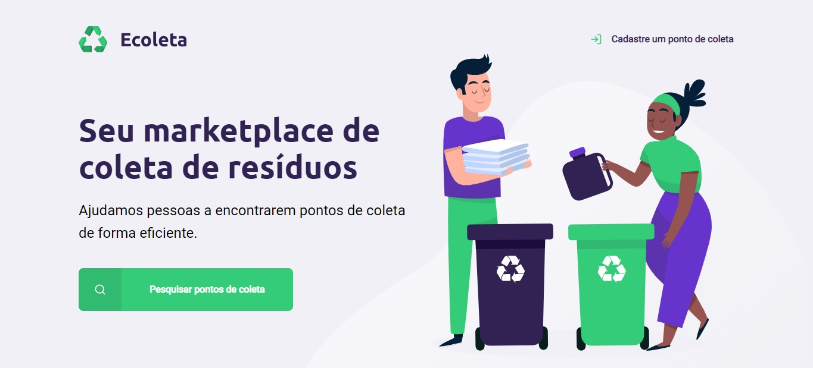
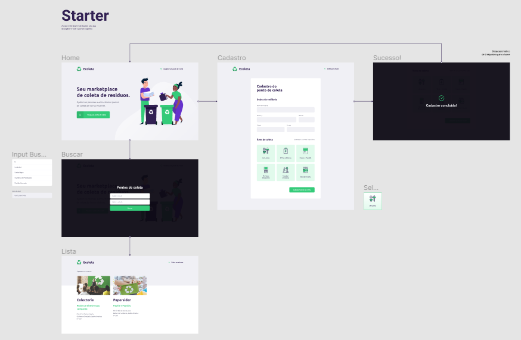

<h1 align="center"> Next Level Week 1.0 - Ecoleta</h1>

## 💡 Sobre o projeto

Projeto construído com a intenção de conectar empresas de coleta de resíduos com pessoas que necessitam descartar seus resíduos de maneira ecológica.

As empresas poderão:
<ul>
    <li>Cadastrar os dados da entidade</li>
    <li>Informar os tipos de itens a serem coletados</li>
</ul>

Os clientes poderão:

<ul>
    <li>Pesquisar os pontos de coleta por cidade/estado</li>
    <li>Visualizar os pontos de coleta mais próximos</li>
</ul>

O projeto Ecoleta está sendo desenvolvido durante a NLW - Next Level Week, oferecido pela <a href="https://rocketseat.com.br/" alt="Rocketseat">Rocketseat 🚀 </a>. O conteúdo será disponibilizado online diariamente durante o período de uma semana.

##  🎨 Layout

O layout está disponível para visualização através do <a href="https://www.figma.com/file/1SxgOMojOB2zYT0Mdk28lB/Ecoleta?node-id=136%3A546" alt="Figma" title="Figma - Ecoleta">figma</a>.

## 💻 Tecnologias Utilizadas

<ul>
    <li>HTML</li>
    <li>CSS</li>
    <li>Javascript</li>
</ul>
